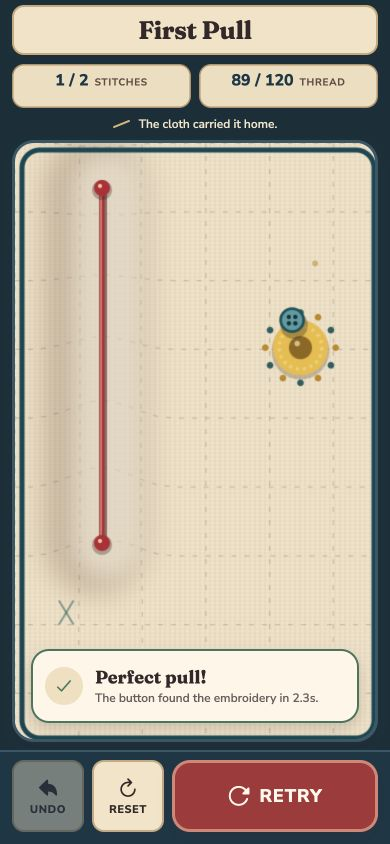

# Archived product README

Archived on 2026-09-06 before removing the old mode from the app. This snapshot
preserves historical mechanics, persistence, purchase, and backend contracts.
Its routes, source paths, configuration steps, and availability claims describe
that earlier version; they are not instructions for the current endless-only
app. Current documentation starts at [the repository README](../../README.md).

---

# Pullthread

**Pull back. Let go. Keep climbing.**

Pullthread is a portrait arcade game built with Expo and React Native. Stretch
an occupied fabric pocket, launch a button-shaped traveler, bounce off stitched
cushions, and catch the next pocket as the handmade playground scrolls upward.
The next pocket is highlighted gold. New pockets and obstacles appear as you climb;
falling off the fabric or touching thorns ends the run.

Endless flight is the main game in development and production builds. It works
offline, with no account or purchase required. Your best pocket count is saved
locally across app launches. Classic stitch puzzles, Daily Scrap, and optional
Full Atelier campaign access remain available through **Settings → Classic
puzzles**.

## Highlights

- Pull to choose direction and power, then release; there is no midair steering.
- Chain catches through a scrolling, seeded playground with moving receivers
  and gradually increasing challenge.
- Pause a run or start again after a fall; each fresh run creates a new layout.
- Improve your local best, counting each new higher pocket actually caught.
- Keep sound, haptics, tutorial hints, high contrast, and reduced motion in Settings.
- Revisit the classic campaign and deterministic Daily Scrap without changing
  their progress, replay, or purchase contracts.
- Run locally on iOS, Android, or the web diagnostic build.

## Technology

- Expo SDK 57, React Native 0.86, and React 19.2
- Strict TypeScript
- React Native Skia for the playfield
- React Native Reanimated and Gesture Handler for tactile interaction
- Zustand for coarse gameplay state
- AsyncStorage for versioned preferences, tutorial completion, and campaign
  progress, a separate endless best, Daily Scrap bests, pending uploads, and the last verified Full
  Atelier entitlement
- RevenueCat `react-native-purchases` behind a platform-neutral entitlement
  service, with a credential-free development mock
- Firebase Anonymous Auth, Firestore, and a replay-validating callable function
  behind a lazy local-first Daily Scrap service
- Expo Audio and Expo Haptics behind a feedback abstraction
- Jest and React Native Testing Library
- Maestro for the installed-app smoke flow

Expo SDK 57 requires Node 22.13 or newer; this repository deliberately pins the
development and CI environment more narrowly to **Node 24.x** through
`package.json`.

## Prerequisites

- Node.js 24.x and npm
- For Android native builds: Android Studio, an Android SDK, and either an
  emulator or a USB-debuggable phone
- For iOS native builds: macOS, a full Xcode installation, signing configured in
  Xcode, and either a simulator or a trusted phone with Developer Mode enabled
- Optional for the smoke flow: the [Maestro CLI](https://docs.maestro.dev/)

No RevenueCat or Firebase configuration is needed for endless flight, the classic
campaign, or local Daily Scrap. Real Full Atelier transactions require platform-specific
RevenueCat public SDK keys and matching App Store / Play products. Shared Daily
Scrap standings require a dedicated Firebase project and public web-app config.

## Install

From the repository root:

```sh
npm ci
npx expo-doctor@latest
```

Use `npm ci`, not `npm install`, for a reproducible install from
`package-lock.json`. Use `npx expo install <package>` when adding an Expo/native
dependency so its version remains compatible with SDK 57.

## Play Pullthread

The app opens directly into **Endless flight**. Drag the occupied pocket
backward and let go to launch. The button follows your pull; a short arc shows
the initial direction without revealing a complete route. Catch the gold
pocket to continue. A moving receiver becomes stationary once caught.

Use **Pause** to take a break and **Play again** after a fall to begin a fresh
run. There are no level breaks or checkpoint retries. A run stays in memory;
its best pocket count is saved locally, separately from classic campaign saves.
A cold app launch starts a fresh run while keeping that best score.

Open **Settings → Classic puzzles** for the Quilt Map, its 15 authored stitch
puzzles, Daily Scrap, and Full Atelier. The map's **Return to endless flight**
action returns to the main game. Existing campaign progress and historical
replays remain available.

### Classic puzzles

The classic game asks you to draw pinch and pocket stitches, deform a quilt's
height field, and guide the button to an embroidered goal. Its local campaign
and Daily Scrap work without a backend; Firebase standings and RevenueCat
purchases are optional integrations.

<p align="center">
  
</p>

### Development client

This project includes `expo-dev-client` and treats a development build as the
physical-device path. The scripts `npm run ios` and `npm run android` start
Metro and open an **already installed** development client; they do not create
the first native binary.

### First install on an Android phone

1. Enable Developer options and USB debugging, connect the phone, and accept
   its trust prompt.
2. Confirm the device is visible with `adb devices`.
3. Build, install, and open the local development client:

   ```sh
   npx expo run:android --device
   ```

4. For later JavaScript-only iterations, keep the installed client and run:

   ```sh
   npm start
   ```

   Open the printed development-client link on the phone. The phone and Metro
   host must be able to reach one another.

### First install on an iPhone

1. Connect and trust the phone, enable Developer Mode, and make sure Xcode can
   sign `com.xuefengzhu.pullthread` for the selected device.
2. Build, install, and open the local development client:

   ```sh
   npx expo run:ios --device
   ```

3. For later JavaScript-only iterations, keep the installed client and run:

   ```sh
   npm start
   ```

   Scan/open the development-client link with the phone.

Rebuild the native development client after changing native dependencies,
native configuration, or the Expo SDK. Both game modes are mostly
JavaScript/TypeScript, but native dependencies still require a fresh client.

RevenueCat support uses the native `react-native-purchases` SDK. Re-run
`npx expo run:ios --device` or `npx expo run:android --device` after changing
native purchase dependencies before testing purchase or restore flows.

## RevenueCat and Full Atelier

Full Atelier applies to the classic campaign only; endless flight is free.
The first six classic levels are free. Levels 7–15 require the one-time Full Atelier
entitlement **and** their normal predecessor completion; buying Full Atelier
does not skip campaign progression. A premium node opens the paywall instead of
starting gameplay. Results and direct level routes apply the same access rule,
so the map is not the only guard. The paywall is never shown at launch.

Pullthread uses these stable RevenueCat identifiers:

```text
entitlement: full_atelier
product:     pullthread_full_game
```

Copy the environment template for local work:

```sh
cp .env.example .env
```

The supported variables are:

| Variable | Meaning |
| --- | --- |
| `EXPO_PUBLIC_ENTITLEMENT_MODE` | `auto`, `mock`, or `revenuecat` |
| `EXPO_PUBLIC_REVENUECAT_IOS_API_KEY` | Apple-platform public SDK key |
| `EXPO_PUBLIC_REVENUECAT_ANDROID_API_KEY` | Google-platform public SDK key |

Mode selection is deliberately fail-safe:

- `auto` uses RevenueCat when the selected native platform has a key. In a
  development build with no key it uses the locked-by-default mock. In a
  production build with no key, purchases remain unavailable and a fresh
  install stays locked; previously RevenueCat-verified offline access remains.
  The development mock never replaces or downgrades that stronger cache record.
- `mock` provides a deterministic local offer, purchase, restore-not-found,
  and development lock/unlock controls without contacting a store. Production
  builds ignore this mode and cannot grant new access.
- `revenuecat` requires the current platform key. A missing key does not unlock
  content; the app uses its unavailable, locked state.
- Web uses the unavailable state unless mock mode is selected. This project
  does not configure RevenueCat Web Billing.

Do not commit real key values. RevenueCat platform SDK keys are public client
configuration rather than secret backend API keys, but this repository keeps
all environment-specific values outside source control. Never place a
RevenueCat secret API key in an `EXPO_PUBLIC_*` variable.

For a real store pass:

1. Create the `pullthread_full_game` non-consumable in App Store Connect and
   Google Play Console as applicable.
2. Mark the Android product non-consumable in RevenueCat, then attach the
   product to the `full_atelier` entitlement and current offering. Pullthread
   rejects subscriptions and ambiguous offering metadata. The installed native
   bridge labels Google Play one-time products `NON_SUBSCRIPTION` + `CONSUMABLE`;
   RevenueCat's dashboard non-consumable setting controls repeat purchase and
   restore behavior on Android. Apple consumables remain rejected.
3. Put only the matching platform public SDK key in the local `.env` or build
   environment and use `EXPO_PUBLIC_ENTITLEMENT_MODE=revenuecat`.
4. Rebuild the native app, sign in with a sandbox/test store account, and test
   purchase, cancellation, and explicit restore on the physical device.

At launch, Pullthread hydrates a versioned local entitlement cache before
rendering navigation, then refreshes RevenueCat asynchronously. A refresh
failure never blocks the offline campaign and does not erase previously
verified access. Purchase and restore still require the platform store and may
fail offline; the paywall reports that failure without changing campaign
progress. Offer details are not treated as durable entitlement proof.

## Daily Scrap and Firebase

Daily Scrap is available from **Settings → Classic puzzles → Daily Scrap**
without an account. The UTC date is
hashed into a stable seed and selects one of six explicitly versioned free
campaign templates. Attempts are unlimited; only the best result is retained,
with lower thread first, then fewer stitches, then lower deterministic
completion time. Watching a compact stitch replay never records campaign
progress.

Every shipped template pool has a finite inclusive date range. Pool v1 covers
2026-01-01 through 2027-12-31; the app and callable must ship the next contiguous
pool before that boundary. An older build fails closed with an update-required
message after its final known date instead of silently generating a challenge
that the backend no longer recognizes.

Local mode is the default and requires no service configuration:

```text
EXPO_PUBLIC_DAILY_SERVICE=local
```

Firebase mode preserves that local save, then lazily signs the player in with
Firebase Anonymous Auth and syncs a verified best to Firestore. The callable
function ignores client score claims, re-runs the canonical replay, derives the
metric tuple, and updates one best document per user in a transaction. Exact
committed retries are idempotent, and leaderboard cutoff ties use the
server-authored recording time rather than a client timestamp. Direct
client writes to challenge and run documents are denied by Firestore rules.
The backend also accepts only today or yesterday, rate-limits each guest, and
caps function scaling. Production deployments should additionally enable
native App Check and callable enforcement before exposing shared standings.

The Firebase web-app values are public identifiers, but environment-specific
values still belong in `.env`, never source control:

| Variable | Meaning |
| --- | --- |
| `EXPO_PUBLIC_DAILY_SERVICE` | `local` or `firebase` |
| `EXPO_PUBLIC_FIREBASE_API_KEY` | Firebase public web API key |
| `EXPO_PUBLIC_FIREBASE_AUTH_DOMAIN` | Firebase Auth domain |
| `EXPO_PUBLIC_FIREBASE_PROJECT_ID` | Dedicated Pullthread project id |
| `EXPO_PUBLIC_FIREBASE_APP_ID` | Firebase web-app id |

Never put a service-account key, private key, or Admin SDK credential in an
`EXPO_PUBLIC_*` variable. The campaign does not initialize Firebase at launch
and remains playable if Firebase is absent or unreachable. See
[`docs/FIREBASE_DAILY_SCRAP.md`](../FIREBASE_DAILY_SCRAP.md) for project
creation, emulator verification, and deployment.

### Simulator, emulator, and web diagnostics

With a compatible development client already installed:

```sh
npm run ios       # open the iOS development client
npm run android   # open the Android development client
npm run web       # browser diagnostic only
```

Web is useful for fast visual inspection, but it does not prove native Skia,
touch, audio, haptics, lifecycle, or phone performance.

Expo's SDK 57 transition guidance recommends development builds for SDK 57;
do not use `npm run start:go` or an Expo Go session as physical-device
evidence. Expo Go is a prototyping client with a fixed native runtime, while a
development build contains this project's native dependencies.

## Quality checks

Run the same checks used by CI:

```sh
npm run lint
npm run typecheck
npm test
npm run export
npm run test:firebase
```

Additional local compatibility check:

```sh
npx expo-doctor@latest
```

`npm run export` produces production JavaScript and asset bundles for the native
platforms. It proves bundling, not native compilation, installation, or runtime
behavior on hardware.

## Maestro smoke flows

The flows expect an installed app with identifier
`com.xuefengzhu.pullthread` and stable React Native `testID` values:

- `endless-game-screen`
- `launch-playfield`
- `launch-score`
- `launch-best`
- `launch-pause-button`
- `launch-paused`
- `launch-resume-button`
- `launch-restart-button`
- `launch-settings-button`
- `settings-classic-button`
- `quilt-map-launch-button`
- `quilt-map-screen`
- `level-node-bedroom-01-first-pull`
- `level-state-bedroom-02-edge-redirect`
- `spike-level-screen`
- `fabric-playfield`
- `tutorial-stitch-anchor`
- `planning-status`
- `stitch-count`
- `release-button`
- `outcome-banner`
- `retry-button`
- `results-button`
- `results-screen`
- `watch-replay-button`
- `replay-stage`
- `results-map-button`
- `try-again-button`
- `settings-screen`
- `settings-entitlement-status`
- `settings-restore-button`
- `level-state-attic-07-pocket-catch`
- `paywall-screen`
- `paywall-status`
- `paywall-purchase-button`
- `paywall-restore-button`
- `paywall-close-button`
- `undo-button`
- `quilt-map-daily-scrap-button`
- `daily-scrap-screen`
- `daily-scrap-play-button`
- `daily-level-screen`
- `daily-scrap-personal-best`
- `daily-leaderboard-section`
- `daily-replay-screen`
- `reset-button`

Start Metro if the installed development build needs it, then run:

```sh
maestro test .maestro/endless-smoke.yaml
maestro test .maestro/spike-smoke.yaml
maestro test .maestro/failure-retry.yaml
maestro test .maestro/full-atelier-mock.yaml
maestro test .maestro/daily-scrap-local.yaml
```

`endless-smoke.yaml` verifies the production entry, pause/resume, a fresh run,
Settings, classic access, return to the paused endless run, and a cold relaunch.
It deliberately avoids screen-coordinate guesses for the Skia gesture. Use
[`docs/ENDLESS_SMOKE_TEST.md`](../ENDLESS_SMOKE_TEST.md) for the manual first
launch, scrolling, failure, tactile, and persisted-best checks. Jest covers
seeded generation, scoring, and persistence; the route smoke alone does not
prove gameplay feel or a nonzero best surviving restart.

The classic flows first navigate through **Settings → Classic puzzles**.
`spike-smoke.yaml` enters Level 1, starts its pull
from the authored in-field guide, completes all three tutorial beats, opens
Results, watches the replay, returns to the map, and verifies that Level 2 is
unlocked. It then cold-relaunches without clearing storage to prove campaign
progress persisted and re-enters Level 1 to verify tutorial completion. The
regression flow enters Level 1 from the map and covers baseline failure, Retry,
Undo, and Reset. Maestro proves the control path on the selected installed
target; it does not judge tactile quality or prove physics determinism by
itself.

`full-atelier-mock.yaml` separately checks the deterministic development mock:
the development tool completes the free path, Level 7 opens the Full Atelier
paywall, restore-not-found is handled, mock purchase makes the reached level
current/playable, and the mock cache survives a cold relaunch. Separate access
tests prove that entitlement alone cannot bypass sequence. This flow
intentionally uses the development mock; it does not exercise StoreKit, Google
Play Billing, RevenueCat receipt validation, localized offers, or real restore
behavior.

`daily-scrap-local.yaml` is a date-agnostic installed-app route smoke for the
local/offline mode: Quilt Map entry, prepared challenge, truthful local board,
Daily gameplay shell, and back navigation. Deterministic completion and best
persistence are exercised in Jest because the selected handcrafted template
rotates at the UTC day boundary. The flow does not prove Firebase deployment or
shared standings.

## Architecture

Endless flight has an isolated ballistic simulation at a fixed 120 Hz, seeded
pocket generation, a monotonic camera, bounded entity retention, and a separate
local best-score store. Its renderer consumes shared traveler/camera values;
React receives coarse catch, bounce, and failure state. Backgrounding, Settings,
and Pause cancel active gestures and discard elapsed background time.

The classic campaign keeps geometry, deformation, physics, level validation, replay
validation, scoring, and tutorial state transitions in pure TypeScript. The
renderer and simulation sample the same height field, while high-frequency
traveler state stays outside React and Zustand render cycles. See
[`docs/ARCHITECTURE.md`](CLASSIC_ARCHITECTURE.md) for the state boundaries,
fixed-step loop, campaign catalog, persistence, and replay boundaries. Level
authors should also read [`docs/LEVEL_FORMAT.md`](../LEVEL_FORMAT.md).

The historical classic implementation plan and tradeoffs live in
[`docs/BUILD_PLAN.md`](../BUILD_PLAN.md), and current game behavior plus classic access and
monetization rules live in [`docs/GAME_DESIGN.md`](CLASSIC_GAME_DESIGN.md).
Device smoke coverage and the extended campaign checklist are documented in
[`docs/CAMPAIGN_SMOKE_TEST.md`](../CAMPAIGN_SMOKE_TEST.md).

## Optional integrations

The default local mode is self-contained: it does not require Firebase,
RevenueCat, or store configuration. To enable the optional services:

- Firebase mode needs a project, Anonymous Auth, Firestore rules and indexes,
  callable backend deployment, and native App Check configuration.
- Real Full Atelier purchases need matching App Store or Google Play products,
  RevenueCat configuration, public platform SDK keys, and a rebuilt native
  client.
- Physical-device validation should use a development build rather than Expo
  Go, so the app's native dependencies are included.

## References

- [Expo SDK 57 reference](https://docs.expo.dev/versions/v57.0.0/)
- [Expo development builds](https://docs.expo.dev/develop/development-builds/introduction/)
- [Using a development build](https://docs.expo.dev/develop/development-builds/use-development-builds/)
- [Expo CLI native run and export commands](https://docs.expo.dev/more/expo-cli/)
- [Maestro command reference](https://docs.maestro.dev/api-reference/commands)
- [RevenueCat with Expo](https://www.revenuecat.com/docs/getting-started/installation/expo)
- [RevenueCat Google Play product setup](https://www.revenuecat.com/docs/getting-started/entitlements/android-products)
- [RevenueCat CustomerInfo and entitlement status](https://www.revenuecat.com/docs/customers/customer-info)
- [RevenueCat purchase restore guidance](https://www.revenuecat.com/docs/getting-started/restoring-purchases)
- [Firebase anonymous authentication](https://firebase.google.com/docs/auth/web/anonymous-auth)
- [Cloud Firestore Security Rules conditions](https://firebase.google.com/docs/firestore/security/rules-conditions)
